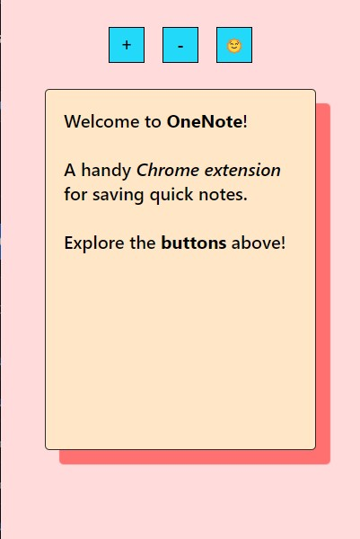
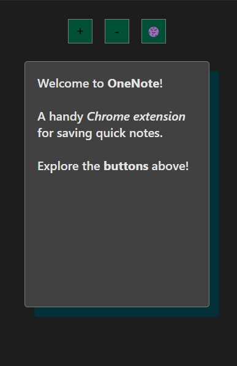

# OneNote

A simple Chrome extension to keep a note handy! OneNote supports text styling such as bold and italicize. 


# Install 
- Clone the repo
- Run ```npm i```
- Run ```npm run build```
- Visit ```chrome://extensions```
- Enable ```Developer mode```
- CLick ```Load unpacked```
- Add ```build``` folder to popup

Or just download the build folder from this repo and start from step 4. 


**Soon will be avaliable via chrome web store**



